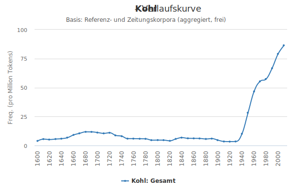
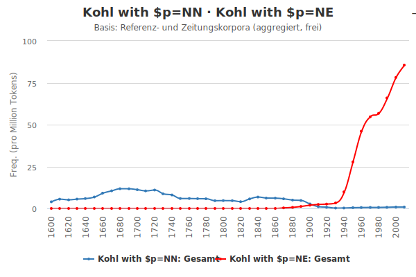
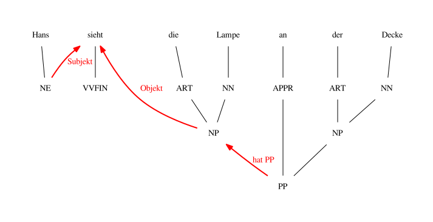

layout: true
  
<div class="my-header"></div>

<div class="my-footer">
  <table>
    <tr>
      <td>Digitales Wörterbuch der Deutschen Sprache</td>
      <td style="text-align:right"><a href="https://www.dwds.de/">www.dwds.de</a></td>
    </tr>
  </table>
</div>

---

class: title-slide

# e-Lexicography

## Techniques and tools for automatic corpus annotation

| Alexander Geyken | Sebastian Göttel | Kay-Michael Würzner |
|:----------------:|:----------------:|:-------------------:|
| [geyken@bbaw.de](mailto:geyken@bbaw.de) | [sebastian.goettel@bbaw.de](mailto:sebastian.goettel@bbaw.de) | [wuerzner@bbaw.de](mailto:wuerzner@bbaw.de) |

---

class: title-slide

# Text corpora

---

# Text corpora

- Collections of texts
- *linguistic* reference corpora
    + *representative* with respect to a language as a whole (or a certain historical form)
        * English: British National Corpus (Burnard, 1995)
        * German: Deutsches Textarchiv (Geyken and Klein, 2009)
- *special* corpora
    + *representative* sample of a language with respect to
        * medium: news paper, (movie) subtitles, internet blogs ...
        * content: infant, youth speech ...
        * research: Penn Treebank (Marcus et al., 1993), childLex (Schroeder et al., 2014)

---

# Corpora and lexicography

- Guidance and knowledge for the lexicographer
- Means of evidence
    + Importance (“Is word *x* frequent enough for my dictionary?”)
    + Grammar (“Does word *x* have a plural?”)
    + Semantics (“Does word *x* have multiple meanings?”)
    + Pragmatics (“Is word *x* a terminus technicus?”)
- Challenge: Corpora are huge! How do we find interesting word occurrences?
- Approach: Abstraction through grouping of tokens

---

class: title-slide

# Linguistic annotation

---

# Linguistic annotation

- Historical: Manual reading and evaluation of text sources
- Not feasible for modern-size corpora: Automatic analysis tool chain
- Annotation of linguistic features as a preprocessing step
    + Easier to search through
    + Easier to identify relevant corpus records
    + Easier to perform quantitative analyses
- With respect to different levels of representation:
    + *Word*: Syllable structure, morphological segmentation, lexical semantics
    + *Word group*: Multi-word expressions, collocations, named entities
    + *Phrases*: Syntactical category and function
    + *Sentence*: Syntactical structure, semantics, textual function

---

# Linguistic annotation

- A sample tool chain:
    + Segmentation of running text into “words” and sentences: **Tokenization**
    + Assignment of base forms to (inflected) words: **Stemming**
    + Assignment of (syntactic) categories to words: **PoS tagging**
    + Determination of the dependencies between words in the sentential context: **Dependency parsing**
    + Evaluation of co-occurrences of words and phrases: **Distributional semantics**
- Can be done automatically (with reliable quality)
- Two fundamental principles of modelling linguistic knowledge:
    + Based on **manually** designed rules (i.e. *rule-based* approaches)
    + Based on **automatically** induced rules (i.e. *machine-learning* approaches)

---

class: title-slide

# Tokenization

---

# Tokenization

- Segmentation of running text into **tokens** and **sentences**
- (Pre-)classification of tokens to support subsequent processing steps
    + Abbreviations
    + Numbers
    + Special characters
    + Foreign alphabets
    + Normalization of hyphenation
- *Rule-based*: White-space segmentation, **regular expressions** (e.g. Greffenstette, 1999)
- *Statistical*: **supervised learning** (given manually tokenized texts, cf. Jurish and Würzner, 2013)

---

# Tokenization

Critical examples
```
Cliff said, “I am pleased to support ACET. ...”
```

---

# Tokenization

- **Challenges**:
    + Ambiguous characters (especially `FULL STOP`)
    + Tokens containing white-space (e.g. URLs)
    + Non-terminated sentences (e.g. headings)
    + Non-standard texts (e.g. chats, tweets)
- Extremely complex rule-based systems
    + Several hundreds of interacting rules
    + Hard to maintain and adjust
- Manual tokenization is easy!
    + Training materials available
    + Low-cost adaption to specific genres

---

# Tokenization

- Sketching a machine-learning approach
    + Define a sequence representation:
        * E.g. running text as sequence of characters
    + Define a classification scheme:
        * E.g. each character can start a token (binary classification)
    + Create some training data:
        * `(A,1),(_,1),(t,1),(e,0),(s,0),(t,0),(.,1)`
    + Select a model family:
        * Hidden Markov Model, Conditional Random Field, Neural Network ...
    + Start training
- Test at [www.dwds.de/waste](http://kaskade.dwds.de/waste/demo.perl)

---

class: title-slide

# Morphological analysis

---

# Morphological analysis

- Task description:
    + Assignment of **possible** word categories
      ```
      greens ↦ {verb, noun}
      Carpenter  ↦ {noun, proper name}
      ```
    + Assignment of a canonical **base form** (*stem* or *lemma*)
      ```
      greens ↦ green
      Carpenter's  ↦ Carpenter
      ```
    + Identification of word formation processes
      ```
      basketball ↦ basket<NN>#ball<NN>
      happily ↦ happy<ADJ>~ly<ADV>
      ```

---

# Morphological analysis

- Machine learning not suitable/successful
    + Manual segmentation is difficult!
- Challenging for languages with complex word formation (e.g. Finnish, German, Turkish)
- `Finite State Morphology` (rule-based approach):
    + Recipe:
        * Take a **huge** list of simple (monomorphematic) words
        * Encode their morphological features
        * Add pre- and suffixes,
    + Put everything into a finite-state automaton
    + Apply its **Kleene closure**
- Reduced to [**stemming**](https://text-processing.com/demo/stem/) (i.e. the removal of pre- and suffixes) for English

---

# Morphological analysis

- Illustration
    + Lexicon `{schön<A>,Geist<N>}`
    + Prefixes `{un<p>,ur<p>}`
    + Suffixes `{heit<N>,lich<A>}`

.center[.img-orig[]]

---

count: false

# Morphological analysis

- Illustration
    + Lexicon `{schön<A>,Geist<N>}`
    + Prefixes `{un<p>,ur<p>}`
    + Suffixes `{heit<N>,lich<A>}`

.center[.img-orig[]]

---

count: false

# Morphological analysis

- Illustration
    + Lexicon `{schön<A>,Geist<N>}`
    + Prefixes `{un<p>,ur<p>}`
    + Suffixes `{heit<N>,lich<A>}`

<center></center>

---

count: false

# Morphological analysis

- Illustration
    + Lexicon `{schön<A>,Geist<N>}`
    + Prefixes `{un<p>,ur<p>}`
    + Suffixes `{heit<N>,lich<A>}`

<center></center>

---

count: false

# Morphological analysis

- Illustration
    + Lexicon `{schön<A>,Geist<N>}`
    + Prefixes `{un<p>,ur<p>}`
    + Suffixes `{heit<N>,lich<A>}`

<center></center>

---

count: false

# Morphological analysis

- Illustration
    + Lexicon `{schön<A>,Geist<N>}`
    + Prefixes `{un<p>,ur<p>}`
    + Suffixes `{heit<N>,lich<A>}`

<center></center>

---

class: title-slide

# Pos tagging

---

# PoS tagging

- Selection of the **most probable** word class in the sentential context from the set of **possible** word classes
- Macine-learning approach, trained using **manually categorized** data, e.g.:
    + Hidden Markov Model using trigrams of words (and class sets, cf. Jurish, 2003)
    + Computation of the most probable sequence of word classes using the Viterbi algorithm
    + (Heuristic selection of the simplest **morphological analysis** for the determined PoS)
    + Easily adaptable to specific text genres (historical language, child language etc.)
- Best-known tool [`TreeTagger`](https://copa-trad.ufsc.br/#tree-tagger-cloud) (multilingual, includes lemmatization facilities)

---

# PoS tagging

- Again, manual PoS tagging is easier than modelling the principles of word class distribution!
    + Machine learning approach instead of rule system
- Important for languages with word class ambiguity (e.g. English, German)
- Subject of many scientific competitions
- Maybe the most important annotation step for lexicographic work

---

# PoS tagging

.center[]

---

count: false

# PoS tagging

.center[]

---

class: title-slide

# Dependency Parsing

---

# Dependency Parsing

- Analysis of the **structural dependencies** between words within a sentence

.center[]

---

class: title-slide

# Many thanks for your attention
